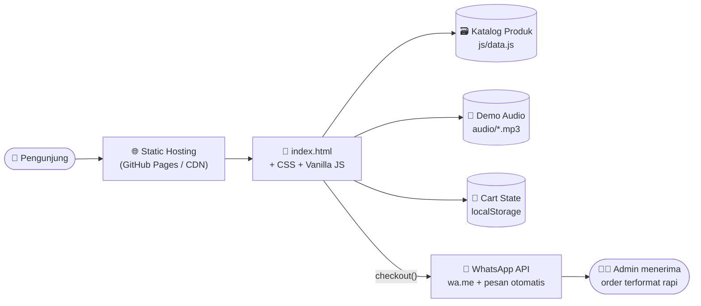
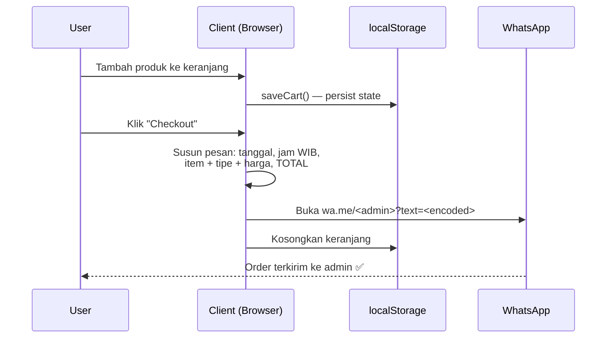

<div align="center">


<br/>

# 🎧 ADIPRMXSTORE

### _Serverless Digital Music Storefront — Zero Backend, Zero Database, 100% Vibes_

**Official Store of Adip Lowkey (formerly ADIP RMX)** — jual FLM Project, Sample Pack, & jasa produksi musik. Static site rasa aplikasi premium.

[](https://git.io/typing-svg)

<br/>


-F7DF1E?style=for-the-badge&logo=javascript&logoColor=black)


<br/>

[🏠 Beranda](#-tentang-project) • [✨ Fitur](#-fitur-lengkap) • [🏗️ Arsitektur](#️-arsitektur--alur-sistem) • [🛠️ Tech Stack](#️-tech-stack) • [⚡ Quick Start](#-quick-start) • [⚙️ Konfigurasi](#️-konfigurasi) • [🗺️ Roadmap](#️-roadmap)

</div>

---

## 📖 Tentang Project

> **"Toko digital yang nggak butuh server, tapi rasanya kayak aplikasi berbayar."**

**ADIPRMXSTORE** adalah storefront digital milik **Nadhif Aslam (Adip Lowkey / ADIP RMX)**, produser & remixer asal Depok, Jawa Barat. Platform ini menjual produk digital musik — **FLM (FL Studio Mobile) Project**, **Sample Pack**, hingga **jasa nyusun Chord & BPM** dan **request remix/edit custom**.

Yang bikin project ini beda: **seluruh pengalaman e-commerce dibangun 100% di sisi klien.** Nggak ada server, nggak ada database, nggak ada biaya hosting — tapi tetap punya katalog dengan filter kompleks, audio player preview ala Spotify, keranjang belanja persisten, dan checkout otomatis yang menyusun pesanan rapi langsung ke WhatsApp admin.

Arsitektur ini disengaja: untuk skala UMKM kreatif, **static-first = nol biaya operasional, nol maintenance server, nol downtime, dan kecepatan loading maksimal** karena semua aset bisa di-serve dari CDN/GitHub Pages.

---

## ✨ Fitur Lengkap

### 🛍️ Katalog & Product Discovery

| Fitur | Detail |
|---|---|
| 🗂️ **Dual Product Tabs** | Tab terpisah untuk **FLM Project** & **Sample Pack**, switch instan tanpa reload |
| 🔍 **Live Search** | Pencarian real-time per keystroke dengan tombol clear satu klik |
| 🎚️ **Multi-Filter Engine** | Filter berlapis: **rentang harga**, **24 genre EDM** (House, Phonk, Amapiano, Brazilian Bass, dst.), dan kombinasi keduanya |
| ↕️ **Smart Sorting** | Urutkan berdasarkan harga termurah/termahal, nama, & relevansi — opsi sort menyesuaikan konteks tab aktif |
| 🏷️ **Active Filter Pills** | Semua filter aktif tampil sebagai chip yang bisa dicabut satu per satu, plus tombol *Clear All* |
| 📊 **Results Counter** | Info jumlah hasil yang ke-filter diperbarui real-time |
| ➕ **Load-More Pagination** | Produk dirender bertahap (batch) — grid tetap ringan meski katalog membesar |
| 🃏 **Rich Product Cards** | Tiap kartu FLM menampilkan **BPM, musical key, durasi, genre, & harga** — metadata yang benar-benar dipakai produser |

### 🎵 Audio Preview Engine (Spotify-like)

| Fitur | Detail |
|---|---|
| ▶️ **Global Mini Player** | Player melayang di bawah layar — lagu tetap jalan saat user scroll katalog |
| 🪟 **In-Modal Player** | Modal detail produk punya player sendiri yang sinkron dengan state global |
| ⏪⏩ **Skip ±3 Detik** | Tombol lompat mundur/maju 3 detik — persis UX aplikasi streaming |
| 🎯 **Click-to-Seek** | Klik di mana pun pada progress bar untuk lompat ke posisi itu |
| 💾 **Self-Hosted Demo Audio** | File demo disimpan **lokal di repo** (`audio/`) — bukan CDN eksternal — supaya HTTP Range Request (seek) selalu berfungsi & nggak bergantung link yang bisa mati |
| 🔵 **Playing Indicator** | Indikator visual di kartu produk yang sedang diputar |
| 🧠 **Lifecycle-Aware** | Player merespons `visibilitychange`, `beforeunload`, & `pagehide` — nggak ada audio "hantu" yang nyangkut saat pindah tab/tutup halaman |

### 🛒 Keranjang & Checkout

| Fitur | Detail |
|---|---|
| 🛒 **Persistent Cart** | Keranjang tersimpan di `localStorage` — refresh halaman pun, isi keranjang nggak hilang |
| 🧾 **Slide-in Cart Drawer** | Panel keranjang meluncur dari samping dengan badge jumlah item |
| 💬 **WhatsApp Auto-Checkout** | Satu klik → sistem menyusun pesan order lengkap (**tanggal & jam WIB, daftar item + tipe + harga, total**) lalu membuka `wa.me` dengan pesan ter-encode rapi |
| 🍞 **Toast Notifications** | Feedback instan untuk setiap aksi (tambah keranjang, checkout, dsb.) |
| 📋 **Copy-to-Clipboard** | Utilitas salin sekali klik untuk info pembayaran |

### 🎛️ Layanan & Request System

- 🎹 **Jasa Nyusun Chord & BPM** — order langsung via modal terstruktur
- 🔁 **Remix Request** — genre bebas, durasi sesuai kebutuhan, revisi sampai puas
- ✂️ **Edit Request** — cut/extend lagu, transisi smooth, format sesuai kebutuhan
- 🛠️ **Custom Request & Paket Bundling** — form request terpadu dengan validasi

### 🎨 UX, Konten & Halaman

- 🌌 **Glassmorphic Dark UI** — estetika gelap dengan blur & glow, konsisten di semua halaman
- 📱 **Fully Responsive + Mobile Menu** — navbar hamburger, smooth scroll antar section
- 💬 **Testimonial Carousel** — 6 testimoni klien dengan rating bintang
- 💭 **100+ Quotes Rotator** — koleksi quotes produksi musik & motivasi yang berganti otomatis (`quotes.js`)
- 🖼️ **Halaman About** — profil lengkap Nadhif Aslam: galeri momen, timeline perjalanan, mitra distribusi, dan kisah di balik nama *Adip Lowkey* & legacy *ADIP RMX*
- 🗃️ **Halaman Archive** — arsip karya terpisah dengan data & renderer khusus
- 🔎 **SEO-Ready** — meta description, keywords, Open Graph, Twitter Card `summary_large_image`, dan `robots: index, follow`

### 💳 Metode Pembayaran (Manual-First)

<div align="center">


</div>

Pembayaran **manual via QRIS, transfer bank, & e-wallet** — konfirmasi lewat WhatsApp. Nol biaya gateway, nol potongan, nol integrasi rumit. Cocok untuk skala kreator independen.

---

## 🏗️ Arsitektur & Alur Sistem

### Filosofi: Static-First, Client-Side Everything



### Alur Checkout (Zero-Server)



### Kenapa Tanpa Backend?

| Aspek | Static-First (project ini) | Storefront konvensional |
|---|---|---|
| 💸 Biaya bulanan | **Rp 0** | Server + DB + domain backend |
| 🚨 Downtime server | **Mustahil** (nggak ada server) | Risiko nyata |
| ⚡ Kecepatan | Di-serve CDN, near-instant | Tergantung backend |
| 🔧 Maintenance | Edit `data.js`, push, selesai | Update dependency, patch server |
| 🔐 Attack surface | Sangat kecil (no DB = no SQLi, no creds = no stuffing) | Luas |

> Backend tetap bisa ditambah nanti (payment gateway, auto-delivery) — lihat [Roadmap](#️-roadmap). Tapi untuk validasi bisnis & operasional harian, arsitektur ini sudah **production-ready**.

---

## 🛠️ Tech Stack

<div align="center">

[](https://skillicons.dev)

</div>

| Layer | Teknologi | Peran |
|---|---|---|
| **Markup** | HTML5 semantic | Struktur 3 halaman: `index`, `about`, `archive` |
| **Styling** | CSS3 murni (~75 KB) | Glassmorphism, grid responsif, animasi — tanpa framework |
| **Logic** | Vanilla JavaScript (~48 KB `script.js`) | Semua state & interaksi — **tanpa jQuery/React/Vue** |
| **State** | Web Storage API | Persistensi keranjang via `localStorage` |
| **Media** | HTML5 `<audio>` + Range Requests | Engine preview dengan seek presisi |
| **Checkout** | WhatsApp Click-to-Chat API | Order terformat otomatis via `wa.me` |
| **Versioning** | Git + GitHub | Source of truth & static hosting |

---

## 📁 Struktur Project

```
adiprmxstore/
│
├── 📄 index.html            # Halaman utama: katalog, cart, player, payment
├── 📄 about.html            # Profil, galeri, timeline, mitra distribusi
├── 📄 archive.html          # Arsip karya
│
├── 🎨 css/
│   ├── style.css            # Design system utama (54 KB)
│   ├── about.css            # Styling halaman About
│   ├── archive.css          # Styling halaman Archive
│   └── carousel.css         # Komponen carousel
│
├── ⚙️ js/
│   ├── script.js            # 🧠 Otak aplikasi: cart, player, filter, modal, checkout
│   ├── data.js              # 🗃️ "Database": 25 FLM Project + Sample Pack + testimoni
│   ├── quotes.js            # 💭 100+ quotes rotator
│   ├── carousel.js          # Logika carousel
│   ├── archive.js           # Renderer halaman arsip
│   ├── archive-data.js      # Data arsip
│   └── gallery-data.js      # Data galeri About
│
├── 🎵 audio/                # Demo track self-hosted (seek-friendly)
│   └── demo/                # Varian demo tambahan
│
├── 🖼️ images/               # Cover produk, logo, QRIS, logo bank & e-wallet
│
└── 📖 README.md             # Kamu di sini
```

> 💡 **Konsep kunci:** `data.js` berperan sebagai *database file-based*. Tambah produk = tambah 1 objek JavaScript. Nggak perlu migrasi, nggak perlu ORM.

---

## ⚡ Quick Start

### 1️⃣ Clone & Jalankan Lokal

```bash
# Clone repo
git clone https://github.com/adiprmx/adiprmxstore.git
cd adiprmxstore

# Opsi A — langsung buka (double-click juga bisa)
start index.html        # Windows
open index.html         # macOS
xdg-open index.html     # Linux

# Opsi B — serve via local server (recommended, biar behavior-nya sama kayak production)
python -m http.server 8000
# atau
npx serve .
```

Buka `http://localhost:8000` — toko langsung jalan. **Nggak ada `npm install`, nggak ada build step, nggak ada `.env`.**

### 2️⃣ Deploy (Gratis, 2 Menit)

| Platform | Cara |
|---|---|
| **GitHub Pages** | `Settings → Pages → Deploy from branch → main / (root)` |
| **Netlify** | Drag & drop folder repo ke app.netlify.com |
| **Vercel** | `vercel` di root folder — auto-detect static site |
| **Cloudflare Pages** | Connect repo, framework preset: *None* |

---

## ⚙️ Konfigurasi

Semua yang perlu diubah ada di **3 titik** — nggak perlu nyelam ke ribuan baris kode:

### 🔢 1. Ganti Nomor WhatsApp Admin

```js
// js/script.js — di dalam function checkout()
const phoneNumber = '628xxxxxxxxxx'; // format: kode negara tanpa '+'
```

### 📦 2. Tambah / Edit Produk

```js
// js/data.js — cukup tambah objek baru ke array
{
  id: 'flm-026',
  name: 'Project Baru Kamu',
  category: 'FLM Project',
  genre: 'House',          // harus ada di flmGenres
  price: 85000,            // dalam Rupiah (angka)
  bpm: 128,
  key: 'A Minor',
  duration: '5:30',
  image: flmCovers[2],
  audioUrl: demoAudios[1]
}
```

Push → produk langsung muncul di katalog lengkap dengan filter, search, & sort. **Itu dia "database migration"-nya.** 😎

### 💭 3. Tambah Quotes

```js
// js/quotes.js — append string baru ke array quotes
"Quote baru kamu di sini.",
```

---

## 🗺️ Roadmap

- [x] Katalog produk dengan filter, search, & sort multi-kriteria
- [x] Audio preview engine dengan seek & skip ±3s
- [x] Keranjang persisten (`localStorage`)
- [x] Checkout otomatis via WhatsApp
- [x] Halaman About & Archive
- [x] SEO meta + Open Graph + Twitter Card
- [ ] 🌙 Toggle Dark/Light mode eksplisit
- [ ] 📲 PWA manifest + service worker (installable, offline-ready)
- [ ] 💳 Integrasi payment gateway (Midtrans/Xendit/Tripay) untuk auto-confirm
- [ ] 📬 Auto-delivery file via email setelah pembayaran terverifikasi
- [ ] 📊 Dashboard admin untuk kelola katalog tanpa edit kode
- [ ] 🌍 Dukungan multi-bahasa (ID/EN)

> Kontribusi untuk item roadmap mana pun sangat diterima — lihat [Kontribusi](#-kontribusi).

---

## 🤝 Kontribusi

Mau ikut ngembangin? Gas:

```bash
# 1. Fork repo ini
# 2. Buat branch fitur
git checkout -b fitur/fitur-keren

# 3. Commit dengan pesan yang jelas
git commit -m "feat: tambah fitur keren"

# 4. Push & buat Pull Request
git push origin fitur/fitur-keren
```

**Guidelines singkat:** tetap vanilla (no framework), jaga konsistensi dark-glass UI, dan pastikan nggak ada dependensi eksternal baru tanpa diskusi di Issues dulu.

---

## 👤 Author

<div align="center">

**Nadhif Aslam** — _Adip Lowkey (formerly ADIP RMX)_
🎧 Produser & Remixer • 📍 Depok, Jawa Barat, Indonesia

[](https://github.com/adiprmx)
[](https://github.com/adiprmx/adiprmxstore)

</div>

---

## 📜 License

Didistribusikan di bawah **MIT License** — kalo mau dipakai harap izin, harap dimodifikasi lagi agar disama samakan, dan dipelajari. Attribution selalu diapresiasi. 🙏

---

## ⭐ Dukung Project Ini

Kalau project ini berguna atau ngasih inspirasi — kasih **⭐ star** di repo ini. Gratis, tapi artinya besar. 🙌

<div align="center">

[](https://star-history.com/#adiprmx/adiprmxstore&Date)

</div>

---

<div align="center">


**Dibangun dengan ☕, 🎧, dan Vanilla JS — tanpa satu pun framework.**

_© Adip Lowkey / ADIP RMX_

</div>
